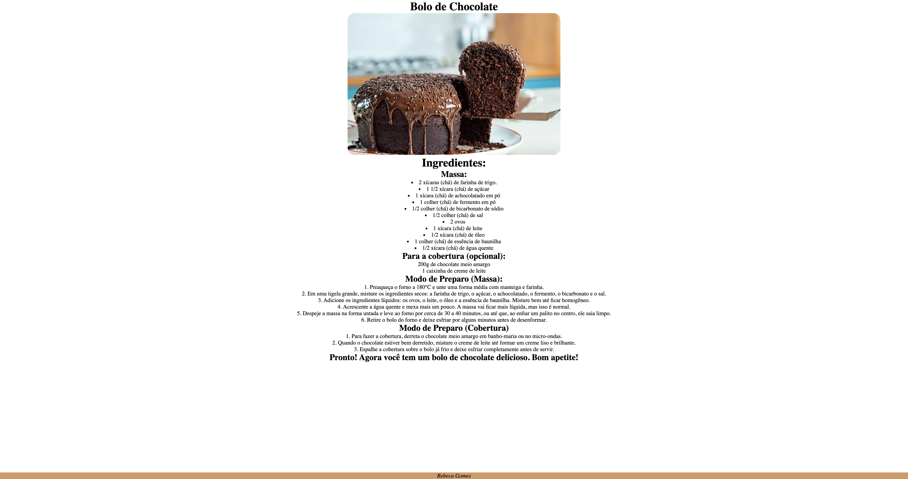

# receita

## Projeto 

Págia de receita de bolo criada durante as aulas da disciplina de Linguagem de marcação no curso da escola SENAI Jandira

## tecnologias
* HTML
* CSS 
* GIT

## Autor 
[Rebeca G.] (https://github.com/rebeca0605)
